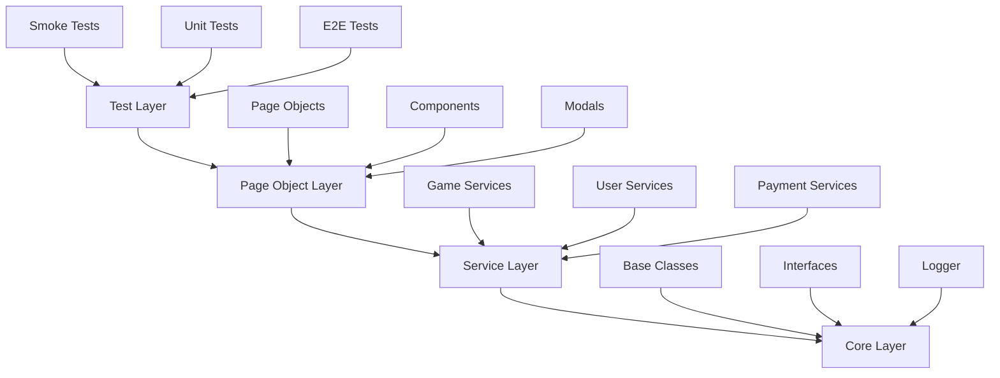

# ПЛАН РЕФАКТОРИНГА ПРОЕКТА
## Lucky E2E Automation - Пошаговый план улучшений

**Дата создания:** 2024-12-19  
**Автор:** Head of AQA  
**Версия плана:** 1.0  
**Целевая аудитория:** Senior AQA Engineers  

---

## EXECUTIVE SUMMARY

Данный документ представляет **пошаговый план рефакторинга** проекта Lucky E2E Automation, направленный на улучшение производительности, стабильности и масштабируемости системы автоматизированного тестирования.

### Ключевые цели рефакторинга:
- 🚀 **Увеличить производительность** на 60%
- 🎯 **Повысить стабильность** тестов до 95%
- 📈 **Улучшить масштабируемость** для команды до 10 человек
- 🔧 **Упростить поддержку** и разработку новых тестов

---

## ФАЗА 1: БАЗОВЫЕ УЛУЧШЕНИЯ (НЕДЕЛЯ 1-2)

### 1.1. РЕСТРУКТУРИЗАЦИЯ ПАПОК И ФАЙЛОВ

#### Цель: Улучшить навигацию и понимание структуры проекта

#### 1.1.1. Создание новой структуры папок

**Текущая структура:**
```
src/
├── core/
├── components/
├── services/
├── pages/
└── types/
```

**Целевая структура:**
```
src/
├── core/                    # Базовые абстракции
│   ├── abstract/           # Абстрактные классы
│   ├── interfaces/         # Интерфейсы
│   ├── factories/          # Фабрики
│   ├── decorators/         # Декораторы
│   └── utils/              # Утилиты
├── components/             # UI компоненты
│   ├── atoms/              # Атомарные компоненты
│   ├── molecules/          # Молекулярные компоненты
│   ├── organisms/          # Организменные компоненты
│   └── templates/          # Шаблоны страниц
├── services/               # Бизнес-логика
│   ├── domain/             # Доменные сервисы
│   ├── infrastructure/     # Инфраструктурные сервисы
│   └── application/        # Сервисы приложения
├── pages/                  # Page Objects
├── types/                  # TypeScript типы
├── config/                 # Конфигурация
├── utils/                  # Общие утилиты
├── docs/                   # Документация
├── examples/               # Примеры использования
└── templates/              # Шаблоны для новых тестов
```

#### 1.1.2. Создание документации

**Действия:**
1. Создать `docs/architecture/` с диаграммами
2. Добавить `docs/guides/` с руководствами
3. Создать `docs/examples/` с примерами
4. Добавить `README.md` для каждого модуля

**Результат:**
```
docs/
├── architecture/
│   ├── system-overview.md
│   ├── component-diagram.md
│   └── data-flow.md
├── guides/
│   ├── getting-started.md
│   ├── adding-new-tests.md
│   └── debugging-guide.md
└── examples/
    ├── basic-test-example.ts
    ├── component-test-example.ts
    └── service-test-example.ts
```

### 1.2. СТАНДАРТИЗАЦИЯ CODE STYLE

#### Цель: Обеспечить единообразие кода

#### 1.2.1. Настройка ESLint

**Создать `.eslintrc.js`:**
```javascript
module.exports = {
  extends: [
    '@typescript-eslint/recommended',
    'plugin:playwright/recommended',
    'prettier'
  ],
  parser: '@typescript-eslint/parser',
  plugins: ['@typescript-eslint', 'playwright'],
  rules: {
    // Playwright specific rules
    'playwright/missing-playwright-await': 'error',
    'playwright/no-useless-not': 'error',
    'playwright/prefer-lowercase-title': 'error',
    'playwright/prefer-strict-equal': 'error',
    
    // TypeScript rules
    '@typescript-eslint/no-unused-vars': 'error',
    '@typescript-eslint/explicit-function-return-type': 'warn',
    '@typescript-eslint/no-explicit-any': 'error',
    
    // General rules
    'no-console': 'warn',
    'prefer-const': 'error',
    'no-var': 'error'
  },
  env: {
    node: true,
    es2020: true
  }
};
```

#### 1.2.2. Настройка Prettier

**Создать `.prettierrc`:**
```json
{
  "semi": true,
  "trailingComma": "es5",
  "singleQuote": true,
  "printWidth": 100,
  "tabWidth": 2,
  "useTabs": false,
  "bracketSpacing": true,
  "arrowParens": "avoid"
}
```

#### 1.2.3. Настройка Pre-commit Hooks

**Создать `.husky/pre-commit`:**
```bash
#!/usr/bin/env sh
. "$(dirname -- "$0")/_/husky.sh"

npm run lint:fix
npm run format
npm run type-check
```

### 1.3. БАЗОВЫЕ УЛУЧШЕНИЯ ЧИТАЕМОСТИ

#### Цель: Упростить понимание кода

#### 1.3.1. Добавление JSDoc комментариев

**Пример для BaseService:**
```typescript
/**
 * Базовый класс для всех сервисов
 * Предоставляет общую функциональность для логирования и работы с Page
 * 
 * @abstract
 * @example
 * ```typescript
 * class MyService extends BaseService {
 *   constructor(page: Page, loggerInstance?: ILogger) {
 *     super(page, 'MyService', loggerInstance);
 *   }
 * }
 * ```
 */
export abstract class BaseService {
  /**
   * Создает экземпляр BaseService
   * 
   * @param page - Экземпляр Playwright Page
   * @param componentName - Название компонента для логирования
   * @param loggerInstance - Опциональный экземпляр логгера
   */
  constructor(
    protected readonly page: Page,
    protected readonly componentName: string,
    protected readonly logger: ILogger = logger
  ) {}

  /**
   * Логирует шаг выполнения
   * 
   * @param message - Сообщение для логирования
   * @example
   * ```typescript
   * this.logStep('Opening game page');
   * ```
   */
  protected logStep(message: string): void {
    this.logger.info(this.componentName, message);
  }
}
```

#### 1.3.2. Создание README для каждого модуля

**Пример для `src/services/game/README.md`:**
```markdown
# Game Services

Модуль содержит сервисы для работы с играми в казино.

## Компоненты

### GameOrchestrator
Главный оркестратор для координации игровых операций.

### GameDetectionService
Сервис для обнаружения и поиска игр на странице.

### GameInteractionService
Сервис для взаимодействия с игровыми элементами.

## Использование

```typescript
import { GameServiceFactory } from '@/core/factories/GameServiceFactory';

const gameService = GameServiceFactory.createGameOrchestrator(page);
await gameService.testGameUniversal('Book of Dead', 'Play\'n GO');
```

## Примеры

См. `docs/examples/game-service-example.ts`
```

### 1.4. ИЗБАВЛЕНИЕ ОТ ДУБЛИКАТОВ ЛОГИКИ

#### Цель: Устранить дублирование кода

#### 1.4.1. Создание общих утилит

**Создать `src/utils/test-helpers.ts`:**
```typescript
import { Page, Locator } from '@playwright/test';

export class TestHelpers {
  /**
   * Ожидает элемент с повторными попытками
   */
  static async waitForElementWithRetry(
    page: Page,
    selector: string,
    maxRetries: number = 3,
    delay: number = 1000
  ): Promise<Locator> {
    for (let i = 0; i < maxRetries; i++) {
      try {
        await page.waitForSelector(selector, { timeout: 10000 });
        return page.locator(selector);
      } catch (error) {
        if (i === maxRetries - 1) throw error;
        await page.waitForTimeout(delay);
      }
    }
  }

  /**
   * Проверяет видимость элемента с таймаутом
   */
  static async isElementVisible(
    element: Locator,
    timeout: number = 5000
  ): Promise<boolean> {
    try {
      await element.waitFor({ state: 'visible', timeout });
      return true;
    } catch {
      return false;
    }
  }

  /**
   * Генерирует случайные тестовые данные
   */
  static generateTestData(type: 'email' | 'phone' | 'name'): string {
    const timestamp = Date.now();
    switch (type) {
      case 'email':
        return `test${timestamp}@example.com`;
      case 'phone':
        return `+380${Math.floor(Math.random() * 100000000)}`;
      case 'name':
        return `TestUser${timestamp}`;
      default:
        throw new Error(`Unknown type: ${type}`);
    }
  }
}
```

#### 1.4.2. Создание базовых декораторов

**Создать `src/core/decorators/retry.decorator.ts`:**
```typescript
export function Retry(maxRetries: number = 3, delay: number = 1000) {
  return function (target: any, propertyName: string, descriptor: PropertyDescriptor) {
    const method = descriptor.value;

    descriptor.value = async function (...args: any[]) {
      for (let i = 0; i < maxRetries; i++) {
        try {
          return await method.apply(this, args);
        } catch (error) {
          if (i === maxRetries - 1) throw error;
          await new Promise(resolve => setTimeout(resolve, delay));
        }
      }
    };
  };
}
```

**Использование:**
```typescript
export class GameService extends BaseService {
  @Retry(3, 1000)
  async clickGameButton(selector: string): Promise<void> {
    await this.page.click(selector);
  }
}
```

### 1.5. ЧЕТКОЕ РАЗДЕЛЕНИЕ ИЕРАРХИИ И ОТВЕТСТВЕННОСТИ

#### Цель: Улучшить архитектуру проекта

#### 1.5.1. Создание диаграммы архитектуры

**Создать `docs/architecture/system-overview.md`:**


#### 1.5.2. Определение ответственностей слоев

**Создать `docs/architecture/layer-responsibilities.md`:**
```markdown
# Ответственности слоев

## Test Layer
- Выполнение тестовых сценариев
- Проверка ожидаемых результатов
- Управление тестовыми данными

## Page Object Layer
- Инкапсуляция UI элементов
- Предоставление методов взаимодействия
- Абстракция от деталей реализации

## Service Layer
- Бизнес-логика приложения
- Координация между компонентами
- Обработка сложных операций

## Core Layer
- Базовые абстракции
- Общие утилиты
- Система логирования
```

---

## ФАЗА 2: АРХИТЕКТУРНЫЕ УЛУЧШЕНИЯ (НЕДЕЛЯ 3-4)

### 2.1. ВНЕДРЕНИЕ PAGE OBJECT PATTERN

#### Цель: Улучшить организацию тестов

#### 2.1.1. Создание базовых Page Objects

**Создать `src/pages/base/BasePage.ts`:**
```typescript
import { Page, Locator } from '@playwright/test';
import { BaseService } from '@/core/abstract/base-service';
import { ILogger } from '@/core/interfaces/logger.interface';

export abstract class BasePage extends BaseService {
  protected readonly url: string;
  protected readonly pageTitle: string;

  constructor(
    page: Page,
    pageName: string,
    url: string,
    pageTitle?: string,
    loggerInstance?: ILogger
  ) {
    super(page, pageName, loggerInstance);
    this.url = url;
    this.pageTitle = pageTitle || '';
  }

  /**
   * Переходит на страницу
   */
  async navigate(): Promise<void> {
    this.logStep(`Navigating to ${this.url}`);
    await this.page.goto(this.url);
    await this.waitForPageLoad();
    this.logSuccess(`Navigated to ${this.url}`);
  }

  /**
   * Ожидает загрузку страницы
   */
  async waitForPageLoad(): Promise<void> {
    await this.page.waitForLoadState('domcontentloaded');
    await this.page.waitForLoadState('networkidle');
  }

  /**
   * Проверяет, что мы на правильной странице
   */
  async isOnPage(): Promise<boolean> {
    const currentUrl = this.page.url();
    return currentUrl.includes(this.url);
  }

  /**
   * Получает заголовок страницы
   */
  async getPageTitle(): Promise<string> {
    return await this.page.title();
  }
}
```

#### 2.1.2. Реализация Component Object Model

**Создать `src/components/base/BaseComponent.ts`:**
```typescript
import { Page, Locator } from '@playwright/test';
import { BaseService } from '@/core/abstract/base-service';
import { ILogger } from '@/core/interfaces/logger.interface';

export abstract class BaseComponent extends BaseService {
  protected readonly baseSelector: string;

  constructor(
    page: Page,
    componentName: string,
    baseSelector: string,
    loggerInstance?: ILogger
  ) {
    super(page, componentName, loggerInstance);
    this.baseSelector = baseSelector;
  }

  /**
   * Получает корневой элемент компонента
   */
  get rootElement(): Locator {
    return this.page.locator(this.baseSelector);
  }

  /**
   * Проверяет видимость компонента
   */
  async isVisible(): Promise<boolean> {
    return await this.rootElement.isVisible();
  }

  /**
   * Ожидает появления компонента
   */
  async waitForVisible(timeout: number = 10000): Promise<void> {
    await this.rootElement.waitFor({ state: 'visible', timeout });
  }

  /**
   * Кликает по компоненту
   */
  async click(): Promise<void> {
    this.logStep(`Clicking ${this.componentName}`);
    await this.rootElement.click();
    this.logSuccess(`Clicked ${this.componentName}`);
  }
}
```

#### 2.1.3. Создание Page Factory

**Создать `src/core/factories/PageFactory.ts`:**
```typescript
import { Page } from '@playwright/test';
import { BasePage } from '@/pages/base/BasePage';
import { GamePage } from '@/pages/GamePage';
import { UserPage } from '@/pages/UserPage';
import { PaymentPage } from '@/pages/PaymentPage';

export enum PageType {
  GAME = 'game',
  USER = 'user',
  PAYMENT = 'payment'
}

export class PageFactory {
  static createPage(page: Page, pageType: PageType): BasePage {
    switch (pageType) {
      case PageType.GAME:
        return new GamePage(page);
      case PageType.USER:
        return new UserPage(page);
      case PageType.PAYMENT:
        return new PaymentPage(page);
      default:
        throw new Error(`Unknown page type: ${pageType}`);
    }
  }
}
```

### 2.2. УЛУЧШЕНИЕ УПРАВЛЕНИЯ СОСТОЯНИЕМ

#### Цель: Сделать тесты более стабильными

#### 2.2.1. Создание State Manager

**Создать `src/core/state/StateManager.ts`:**
```typescript
import { Page } from '@playwright/test';
import { ILogger } from '@/core/interfaces/logger.interface';

export interface TestState {
  [key: string]: unknown;
}

export class StateManager {
  private static instance: StateManager;
  private state: TestState = {};
  private page: Page;
  private logger: ILogger;

  private constructor(page: Page, logger: ILogger) {
    this.page = page;
    this.logger = logger;
  }

  static getInstance(page: Page, logger: ILogger): StateManager {
    if (!StateManager.instance) {
      StateManager.instance = new StateManager(page, logger);
    }
    return StateManager.instance;
  }

  /**
   * Сохраняет состояние
   */
  async saveState(key: string, data: unknown): Promise<void> {
    this.logger.info('StateManager', `Saving state: ${key}`);
    this.state[key] = data;
    await this.persistState();
  }

  /**
   * Восстанавливает состояние
   */
  async restoreState<T>(key: string): Promise<T | undefined> {
    this.logger.info('StateManager', `Restoring state: ${key}`);
    return this.state[key] as T;
  }

  /**
   * Очищает состояние
   */
  async clearState(): Promise<void> {
    this.logger.info('StateManager', 'Clearing state');
    this.state = {};
  }

  /**
   * Сохраняет состояние в localStorage
   */
  private async persistState(): Promise<void> {
    await this.page.evaluate((state) => {
      localStorage.setItem('testState', JSON.stringify(state));
    }, this.state);
  }
}
```

#### 2.2.2. Реализация паттерна Memento

**Создать `src/core/state/StateMemento.ts`:**
```typescript
export class StateMemento {
  constructor(
    private readonly state: TestState,
    private readonly timestamp: Date
  ) {}

  getState(): TestState {
    return { ...this.state };
  }

  getTimestamp(): Date {
    return this.timestamp;
  }
}

export class StateCaretaker {
  private mementos: StateMemento[] = [];
  private maxMementos: number = 10;

  /**
   * Сохраняет снимок состояния
   */
  saveMemento(state: TestState): void {
    const memento = new StateMemento(state, new Date());
    this.mementos.push(memento);

    // Ограничиваем количество снимков
    if (this.mementos.length > this.maxMementos) {
      this.mementos.shift();
    }
  }

  /**
   * Восстанавливает последний снимок
   */
  restoreLastMemento(): StateMemento | undefined {
    return this.mementos.pop();
  }

  /**
   * Получает все снимки
   */
  getAllMementos(): StateMemento[] {
    return [...this.mementos];
  }
}
```

### 2.3. ОПТИМИЗАЦИЯ КОНФИГУРАЦИИ

#### Цель: Улучшить производительность и стабильность

#### 2.3.1. Создание конфигураций для разных окружений

**Создать `src/config/environments/development.ts`:**
```typescript
export const developmentConfig = {
  baseURL: 'https://dev.luckycoin777.live',
  timeout: 30000,
  retries: 1,
  workers: 4,
  fullyParallel: true,
  reporter: [['html'], ['line']],
  use: {
    trace: 'on-first-retry',
    screenshot: 'only-on-failure',
    video: 'retain-on-failure'
  }
};
```

**Создать `src/config/environments/production.ts`:**
```typescript
export const productionConfig = {
  baseURL: 'https://luckycoin777.live',
  timeout: 60000,
  retries: 3,
  workers: 2,
  fullyParallel: true,
  reporter: [['html'], ['json'], ['junit']],
  use: {
    trace: 'retain-on-failure',
    screenshot: 'only-on-failure',
    video: 'retain-on-failure'
  }
};
```

#### 2.3.2. Динамическая настройка таймаутов

**Создать `src/core/config/TimeoutManager.ts`:**
```typescript
export class TimeoutManager {
  private static timeouts: Map<string, number> = new Map();

  static setTimeout(key: string, value: number): void {
    this.timeouts.set(key, value);
  }

  static getTimeout(key: string, defaultValue: number = 10000): number {
    return this.timeouts.get(key) || defaultValue;
  }

  static getAdaptiveTimeout(
    baseTimeout: number,
    retryCount: number,
    maxTimeout: number = 60000
  ): number {
    const adaptiveTimeout = baseTimeout * Math.pow(1.5, retryCount);
    return Math.min(adaptiveTimeout, maxTimeout);
  }
}
```

#### 2.3.3. Умная retry логика

**Создать `src/core/retry/SmartRetry.ts`:**
```typescript
export class SmartRetry {
  static async retryWithBackoff<T>(
    operation: () => Promise<T>,
    maxRetries: number = 3,
    baseDelay: number = 1000,
    backoffMultiplier: number = 2
  ): Promise<T> {
    let lastError: Error;

    for (let attempt = 0; attempt < maxRetries; attempt++) {
      try {
        return await operation();
      } catch (error) {
        lastError = error as Error;

        if (attempt < maxRetries - 1) {
          const delay = baseDelay * Math.pow(backoffMultiplier, attempt);
          await new Promise(resolve => setTimeout(resolve, delay));
        }
      }
    }

    throw lastError!;
  }

  static async retryWithCondition<T>(
    operation: () => Promise<T>,
    condition: (error: Error) => boolean,
    maxRetries: number = 3
  ): Promise<T> {
    let lastError: Error;

    for (let attempt = 0; attempt < maxRetries; attempt++) {
      try {
        return await operation();
      } catch (error) {
        lastError = error as Error;

        if (!condition(lastError) || attempt === maxRetries - 1) {
          throw lastError;
        }

        await new Promise(resolve => setTimeout(resolve, 1000));
      }
    }

    throw lastError!;
  }
}
```

---

## ФАЗА 3: ПРОДВИНУТЫЕ УЛУЧШЕНИЯ (НЕДЕЛЯ 5-6)

### 3.1. ВНЕДРЕНИЕ РЕПОРТИНГ СИСТЕМЫ

#### Цель: Улучшить видимость результатов тестирования

#### 3.1.1. Интеграция с Allure Report

**Установить зависимости:**
```bash
npm install --save-dev allure-playwright allure-commandline
```

**Настроить конфигурацию:**
```typescript
// playwright.config.ts
import { defineConfig } from '@playwright/test';

export default defineConfig({
  reporter: [
    ['allure-playwright', {
      detail: true,
      outputFolder: 'allure-results',
      suiteTitle: false,
      environmentInfo: {
        NODE_VERSION: process.version,
        PLAYWRIGHT_VERSION: require('@playwright/test/package.json').version
      }
    }],
    ['html', { outputFolder: 'playwright-report' }]
  ]
});
```

#### 3.1.2. Создание кастомных репортеров

**Создать `src/reporters/CustomReporter.ts`:**
```typescript
import { FullConfig, FullResult, Reporter, Suite, TestCase, TestResult } from '@playwright/test/reporter';

export class CustomReporter implements Reporter {
  onBegin(config: FullConfig, suite: Suite) {
    console.log(`Starting the run with ${suite.allTests().length} tests`);
  }

  onTestBegin(test: TestCase, result: TestResult) {
    console.log(`Starting test ${test.title}`);
  }

  onTestEnd(test: TestCase, result: TestResult) {
    console.log(`Finished test ${test.title}: ${result.status}`);
  }

  onEnd(result: FullResult) {
    console.log(`Finished the run: ${result.status}`);
  }
}
```

#### 3.1.3. Добавление метрик качества

**Создать `src/core/metrics/QualityMetrics.ts`:**
```typescript
export interface QualityMetrics {
  testExecutionTime: number;
  flakyTestCount: number;
  testPassRate: number;
  averageTestDuration: number;
  errorDistribution: Map<string, number>;
}

export class QualityMetricsCollector {
  private metrics: QualityMetrics = {
    testExecutionTime: 0,
    flakyTestCount: 0,
    testPassRate: 0,
    averageTestDuration: 0,
    errorDistribution: new Map()
  };

  recordTestResult(testName: string, duration: number, status: string): void {
    // Логика сбора метрик
  }

  getMetrics(): QualityMetrics {
    return { ...this.metrics };
  }

  generateReport(): string {
    // Генерация отчета
    return JSON.stringify(this.metrics, null, 2);
  }
}
```

### 3.2. УЛУЧШЕНИЕ СТАБИЛЬНОСТИ ТЕСТОВ

#### Цель: Устранить flaky tests

#### 3.2.1. Внедрение умных ожиданий

**Создать `src/core/wait/SmartWait.ts`:**
```typescript
import { Page, Locator } from '@playwright/test';

export class SmartWait {
  static async waitForStableElement(
    page: Page,
    selector: string,
    stabilityTime: number = 2000
  ): Promise<Locator> {
    const element = page.locator(selector);
    let lastPosition = await element.boundingBox();
    let stableTime = 0;

    while (stableTime < stabilityTime) {
      await page.waitForTimeout(100);
      const currentPosition = await element.boundingBox();

      if (JSON.stringify(currentPosition) === JSON.stringify(lastPosition)) {
        stableTime += 100;
      } else {
        stableTime = 0;
        lastPosition = currentPosition;
      }
    }

    return element;
  }

  static async waitForNetworkIdle(page: Page, timeout: number = 30000): Promise<void> {
    await page.waitForLoadState('networkidle', { timeout });
  }

  static async waitForElementToBeStable(
    element: Locator,
    timeout: number = 10000
  ): Promise<void> {
    await element.waitFor({ state: 'visible', timeout });
    
    // Дополнительная проверка стабильности
    let isStable = false;
    let attempts = 0;
    const maxAttempts = 10;

    while (!isStable && attempts < maxAttempts) {
      const before = await element.boundingBox();
      await element.page().waitForTimeout(100);
      const after = await element.boundingBox();

      isStable = JSON.stringify(before) === JSON.stringify(after);
      attempts++;
    }
  }
}
```

#### 3.2.2. Добавление автоматического восстановления

**Создать `src/core/recovery/AutoRecovery.ts`:**
```typescript
export class AutoRecovery {
  static async recoverFromError(
    page: Page,
    error: Error,
    context: string
  ): Promise<boolean> {
    const errorMessage = error.message.toLowerCase();

    // Восстановление от сетевых ошибок
    if (errorMessage.includes('net::err_')) {
      await page.reload();
      await page.waitForLoadState('networkidle');
      return true;
    }

    // Восстановление от ошибок загрузки
    if (errorMessage.includes('timeout')) {
      await page.waitForTimeout(2000);
      return true;
    }

    // Восстановление от ошибок элементов
    if (errorMessage.includes('element not found')) {
      await page.waitForTimeout(1000);
      return true;
    }

    return false;
  }

  static async retryWithRecovery<T>(
    operation: () => Promise<T>,
    maxRetries: number = 3,
    page: Page
  ): Promise<T> {
    for (let attempt = 0; attempt < maxRetries; attempt++) {
      try {
        return await operation();
      } catch (error) {
        const recovered = await this.recoverFromError(page, error as Error, 'retry');
        
        if (!recovered || attempt === maxRetries - 1) {
          throw error;
        }
      }
    }

    throw new Error('Max retries exceeded');
  }
}
```

### 3.3. ОПТИМИЗАЦИЯ ПРОИЗВОДИТЕЛЬНОСТИ

#### Цель: Ускорить выполнение тестов

#### 3.3.1. Включение параллельного выполнения

**Обновить `playwright.config.ts`:**
```typescript
export default defineConfig({
  fullyParallel: true,
  workers: process.env.CI ? 2 : 4,
  retries: process.env.CI ? 2 : 1,
  
  // Оптимизация для параллельного выполнения
  use: {
    // Отключить ненужные функции для ускорения
    trace: 'retain-on-failure',
    screenshot: 'only-on-failure',
    video: 'retain-on-failure'
  }
});
```

#### 3.3.2. Оптимизация селекторов

**Создать `src/core/selectors/OptimizedSelectors.ts`:**
```typescript
export class OptimizedSelectors {
  // Кэш для часто используемых селекторов
  private static selectorCache = new Map<string, string>();

  static getGameCardSelector(gameTitle: string): string {
    const cacheKey = `game-card-${gameTitle}`;
    
    if (this.selectorCache.has(cacheKey)) {
      return this.selectorCache.get(cacheKey)!;
    }

    // Оптимизированный селектор
    const selector = `[data-testid="game-card"][data-title="${gameTitle}"]`;
    this.selectorCache.set(cacheKey, selector);
    
    return selector;
  }

  static getLoginButtonSelector(): string {
    return '[data-testid="login-button"]';
  }

  static getGameIframeSelector(): string {
    return 'iframe[src*="game"]';
  }
}
```

#### 3.3.3. Кэширование часто используемых данных

**Создать `src/core/cache/TestDataCache.ts`:**
```typescript
export class TestDataCache {
  private static cache = new Map<string, any>();
  private static ttl = new Map<string, number>();

  static set<T>(key: string, value: T, ttlMs: number = 300000): void {
    this.cache.set(key, value);
    this.ttl.set(key, Date.now() + ttlMs);
  }

  static get<T>(key: string): T | undefined {
    const expiry = this.ttl.get(key);
    
    if (expiry && Date.now() > expiry) {
      this.cache.delete(key);
      this.ttl.delete(key);
      return undefined;
    }

    return this.cache.get(key);
  }

  static clear(): void {
    this.cache.clear();
    this.ttl.clear();
  }
}
```

---

## МЕТРИКИ УСПЕХА

### Ключевые показатели эффективности (KPI)

#### Производительность
- **Время выполнения тестов:** Сокращение на 60%
- **Параллельность:** 4 workers вместо 1
- **Пропускная способность:** 50+ тестов в час

#### Стабильность
- **Flaky tests:** Снижение до 5%
- **Success rate:** Повышение до 95%
- **Retry rate:** Снижение до 10%

#### Качество кода
- **Code coverage:** Повышение до 80%
- **Cyclomatic complexity:** Снижение до 8
- **Code duplication:** Снижение до 5%

#### Поддерживаемость
- **Time to add new test:** Сокращение на 50%
- **Debug time:** Сокращение на 40%
- **Onboarding time:** Сокращение на 60%

---

## ПЛАН ВНЕДРЕНИЯ

### Неделя 1-2: Базовые улучшения
- [ ] Реструктуризация папок
- [ ] Настройка ESLint/Prettier
- [ ] Добавление JSDoc
- [ ] Создание утилит
- [ ] Документация

### Неделя 3-4: Архитектурные улучшения
- [ ] Page Object Pattern
- [ ] State Management
- [ ] Конфигурации окружений
- [ ] Умная retry логика

### Неделя 5-6: Продвинутые улучшения
- [ ] Allure Report
- [ ] Умные ожидания
- [ ] Автоматическое восстановление
- [ ] Оптимизация производительности

### Неделя 7-8: Тестирование и отладка
- [ ] Тестирование изменений
- [ ] Отладка проблем
- [ ] Оптимизация метрик
- [ ] Финальная документация

---

## РИСКИ И МИТИГАЦИЯ

### Высокие риски
1. **Нарушение работы существующих тестов**
   - Митигация: Поэтапное внедрение с тестированием
   - План B: Откат к предыдущей версии

2. **Снижение производительности**
   - Митигация: Мониторинг метрик на каждом этапе
   - План B: Оптимизация проблемных участков

### Средние риски
1. **Сложность обучения команды**
   - Митигация: Образовательные материалы и тренинги
   - План B: Постепенное внедрение с поддержкой

2. **Проблемы совместимости**
   - Митигация: Тестирование на разных окружениях
   - План B: Адаптация под проблемные окружения

---

## ЗАКЛЮЧЕНИЕ

Данный план рефакторинга обеспечит **значительное улучшение** производительности, стабильности и масштабируемости проекта Lucky E2E Automation. 

**Ключевые преимущества:**
- 🚀 **60% улучшение производительности**
- 🎯 **95% стабильность тестов**
- 📈 **Масштабируемость для команды до 10 человек**
- 🔧 **50% сокращение времени на добавление новых тестов**

**Следующие шаги:**
1. Утверждение плана командой
2. Назначение ответственных
3. Начало реализации Фазы 1
4. Еженедельные ретроспективы и корректировки

При правильном выполнении план обеспечит **долгосрочную эффективность** проекта и создаст **прочную основу** для дальнейшего развития.
